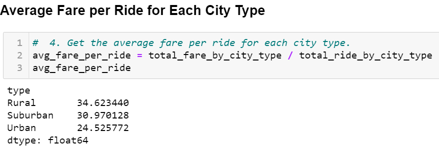

# PyBer_Analysis : Analyzing Ride-Sharing Fare Data for Urban, Suburban and Rural Cities
Module 5
## Objective

The objective of this project is to analyze the data of fares collected by a python based ride-sharing company, **_PyBer_**, in Urban, Suburban and Rural cities. The data collected on 2019 consisted for six columns: city names, city types (urban, suburban and rural), date, ride id, driver count and fare per ride. The goal was to summarize the data and present it to V. Isualize who is the CEO of the company, PyBer. We made a ride-sharing summary DataFrame by the city type (_**Deliverable 1**_) and plotted a multiple-line chart of total fares for each city type (_**Deliverable 2**_). The analysis and vizuations we provide the CEO of the company will help with improving the ride sharing services and affordability of underserved neighborhood. 

## Purpose
The purpose is to learn and practice Python data manipulation using DataFrame and visualization of data different ways such as line plot, scatter and bubble plot, bar graph and pie-chart. We learned to plot graphs using Matlab method and Object-Oriented method. We wrote a python script using Pandas library, Jupyter Notebook to showcase data in different ways. We created and manipulated data in DataFrame, calculated averages. Finally, we used Matplotlib, a 2-dimensional plotting library to plot data for visualization. 

## Results
We were given two csv files with raw data, _city_data.csv_ and _ride_data.csv_. We used Jupyter Notebook and Pandas to inspect data, merge the data sets (based on city names), perform calculations and created a data series and DataFrames. The summary of the results is shown below.

### **Deliverable 1**

**Fig.1** - The image shows the total number of riders for each type of city.

**Fig. 2** The image shows the information about total number of drivers for each type of city. 

**Fig. 3** The image shows the total fare for each type of city using _"groupby"_ and _"sum_( )". 

**Fig. 4** The image shows that cost of ride-sharing in rural cities is more than the cost of ride-share in urban cities. This is expected since there are about 31 times more drivers in urban cities compared to rural cities. Rural drivers can ask for more price since the choice is less if someone in the rural area needs it. 

**Fig. 5**  The figure shows that rural drivers can charge more in the rural cities. A driver in the rural area is able to charge more compared to urban or suburban cities. This is because of driver shortage in rural areas. There is also less need for ride-sharing service in the rural cities. 

**Fig. 6** The figure shows a formatted summary DataFrame of all the data shown above. 

### **Deliverable 2**

We created a multiple-line graph that shows the total fares for each week by city type using Pandas. The figures below show the requirements for this Deliverable.

**Fig. 7** This figure shows a DataFrame that is grouped by "Type" of city and "date" column. The fare is summed for each date and time. 

**Fig. 8** The figure above shows the DataFrame created using the _pivot_( ) function. The "date" is the index, the city types are the column and the values of the column are the fares. 

**Fig. 9** This figure shows the _loc_ command used to create the DataFrame for fare in January through April 29 on 2019. 

**Fig. 10** The figure shows a DataFrame using _resample(W)_ by week from January 1 through Aapril 29 on 2019. 

**Fig. 11** This figure shows an annotated multi-line graph that shows total Fare by city type from the begnning of January through the end of April for 2019.

### Summary and Recommendation

The data and the multiple-line graph shows that urban cities generated more revenues compared to suburban and rural cities. This is expected since urban cities have a higher population. While the fare per ride is less in the urban cities compared to the rural areas, total revenue is higher because of the higher number of drivers available. There seems to be a slight peak in the fare just before March in all three types of cities. This time is the end of Winter and beginning of the Spring. I recommend that it would be more profitable for the PyBer ride-share company to increase the drivers in all three types of cities. The end of the winter is a good time to make more ride-sharing available for customers. The trend of the graph suggests that more driver is needed in the rural areas to generate more revenue. However, I suggest that more study is needed to know the demand in the rural areas. The company would not benefit much by increasing the driver numbers if the demand is less. It would be more profitable to increase the driver availability in the suburban areas since many people move in the suburban area when the cost of living becomes too high in the urban cities. 